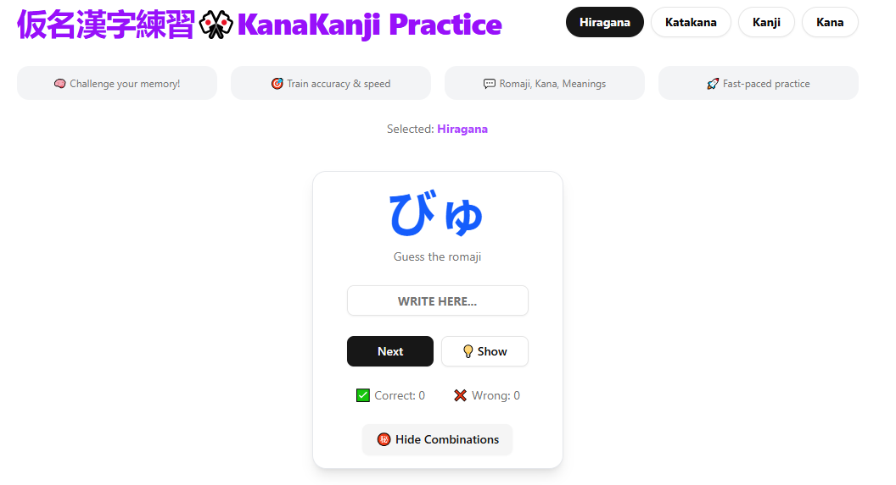

# KanaKanji Practice

## Master Japanese Hiragana, Katakana, Kanji

[]
[](https://kanakanji.vercel.app/)



## 📘 Overview

Kana Quiz is a comprehensive, interactive application designed to facilitate efficient learning of Japanese writing systems. This educational tool offers structured practice for Hiragana, Katakana, Kanji, and combined Kana characters, making Japanese language acquisition accessible and engaging for learners at all levels.

## ✨ Key Features

- **Specialized Quiz Modules** — Dedicated practice environments for Hiragana, Katakana, Kanji, and combined Kana
- **Immediate Learning Feedback** — Real-time assessment with clear visual indicators for correct and incorrect responses
- **Performance Analytics** — Comprehensive tracking of correct/incorrect answer ratios and learning progress
- **Enhanced Character Context** — In-depth information including meanings, on'yomi (Chinese-derived readings), and kun'yomi (native Japanese readings)
- **Optimized User Experience** — Fluid animations and transitions to enhance engagement and retention
- **Cross-Device Compatibility** — Responsive design that adapts seamlessly to mobile, tablet, and desktop interfaces

## 🔍 How It Works

1. **Select Your Focus Area** — Choose between Hiragana, Katakana, Kanji, or combined Kana quizzes
2. **Character Recognition Challenge** — Identify the meaning or reading of displayed characters
3. **Learning-Oriented Feedback** — Receive immediate confirmation and explanation after each response
4. **Progress Monitoring** — View performance metrics to identify strengths and areas for improvement

## 🛠️ Technology Stack

- **Frontend Framework**: React
- **Animation Library**: Framer Motion
- **Styling Solution**: Tailwind CSS
- **Deployment Platform**: Vercel

## 🚀 Getting Started

### Prerequisites
- Node.js (v14 or later)
- npm or yarn

### Installation

```bash
# Clone the repository
git clone https://github.com/YOUR_USERNAME/KanaKanji-Practice.git

# Navigate to project directory
cd KanaKanji-Practice

# Install dependencies
npm install
# or
yarn install
```

### Development

```bash
# Start development server
npm run dev
# or
yarn dev

# Access the application at http://localhost:3000
```

## 📊 Performance Tracking

- **Success Rate** — Monitor your character recognition accuracy
- **Challenge Areas** — Identify patterns in incorrect responses for targeted review
- **Learning Curve** — View progression metrics across practice sessions [INCOMING!]

## 🔮 Roadmap

- Audio pronunciation guides for authentic character readings
- Spaced repetition algorithm implementation for optimized retention
- User account integration for cross-device progress synchronization
- Expanded Kanji library with JLPT level categorization

## 🤝 Contributing

Kana Quiz is an open-source project welcoming contributions from the community. Whether you're fixing bugs, adding features, or improving documentation, your help is appreciated.

### Contribution Process

1. Fork the repository
2. Create a feature branch (`git checkout -b feature/amazing-feature`)
3. Commit your changes (`git commit -m 'Add some amazing feature'`)
4. Push to your branch (`git push origin feature/amazing-feature`)
5. Open a Pull Request

## 📜 License

This project is licensed under the MIT License - see the [LICENSE](LICENSE.md) file for details.

## 🌐 Live Demo

[Visit Kana Quiz](https://kanakanji.vercel.app/)

---

<p align="center">
  <i>Elevate your Japanese language journey with KanaKanji Practice.</i><br>
  <b>Learn. Practice. Master.</b>
</p>